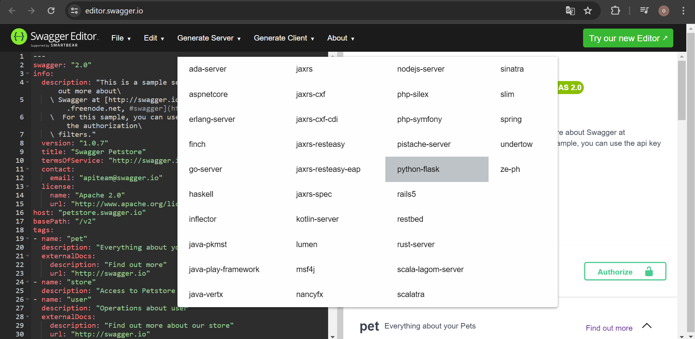

## Crear un server con Swagger

Crea una carpeta en tu escritorio que se llame swagger.  
En ella vamos a guardar todo lo que tenga que ver con este ejercicio.

Entrar a:

> https://editor.swagger.io/


   
Si tienes un proyecto en mente, debes modificar la configuración Swagger, pero para que tengas una idea general, vamos a dejar el código del servidor sin modificar para generar un server. Una vez ya lo hayas hecho se te facilitará hacerlo para tus propias APPs.

En el menu superior están las siguientes opciones:

<ul>
<li>File</li>
<li>Edit</li>
<li>Generate Server</li>
<li>Generate Client</li>
<li>About</li>
</ul>

En este caso vas a generar un servidor en python, asi que le dale click a <b>Generate Server</b> y elige <b>python-fast</b>.



Automaticamente se descargará un proyecto comprimido, que debes guardar en la carpeta swagger que creamos en el escritorio.


Descomprime esta carpeta; entra en <b>python-flask-server</b>.  
Se mostrará como sigue:


Sube el proyecto a tu <b>github</b>, desde ahora, para que puedas hacer pruebas controladas de tu experiencia de aprendizaje. Una vez hayas cargado el proyecto en github, descargarlo con <b>git clone</b>. Y pasamos a describir la experiencia de manera puntual, como de costumbre. Luego, intentaremos seguir los pasos del <b>README.md</b> que fue generado, a ver que pasa. (En este proyecto  <b>README.md</b> ha sido cambiado de nombre a README_SWAGGER.md).

<pre>
python -m venv env
./env/Scripts/activate
python -m pip install --upgrade pip
pip install -r requirements.txt
python -m swagger_server
</pre>

Se presentan errores:


## Gestión del error

Solución encontrada en foros de github:  


https://github.com/swagger-api/swagger-codegen/issues/12278

De acuerdo a la solución de <b>@rlinke</b>:

Hay que Modificar el requirements.txt.  
Yo prefiero crear un requirements nuevo con otro nombre: <b>requirementsIssues12278.txt</b>
<pre>
deactivate
rm -R env
python -m venv env
./env/Scripts/activate
python -m pip install --upgrade pip
pip install -r requirementsIssues12278.txt
python -m swagger_server
</pre>

### Abre tu navegador hasta aquí:

```
http://localhost:8080/v2/ui/
```

### Salir de la prueba:

> "Press CTRL+C to quit"

<pre>
deactivate
rm -R env
</pre>

***
